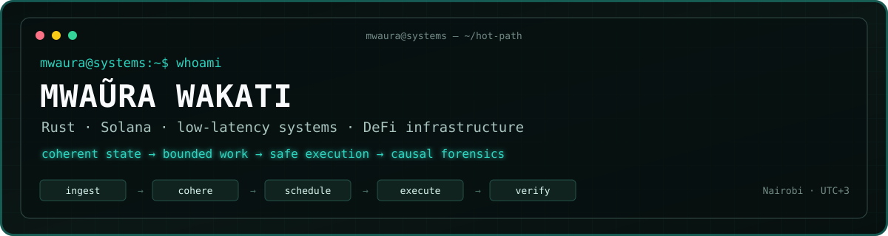

<p align="center">
  
</p>

<p align="center">
  <a href="mailto:mwaurawakati@gmail.com"></a>
  <a href="https://www.linkedin.com/in/mwaurawakati"></a>
  <a href="https://github.com/mwaurawakati/portifolio"></a>
  <a href="https://github.com/mwaurawakati/portifolio/raw/main/cv/Mwaura-Wakati-Staff-Rust-Solana-Engineer-CV.pdf"></a>
</p>

<p align="center">
  <code>Nairobi, Kenya · UTC+3</code>&nbsp;&nbsp;·&nbsp;&nbsp;<strong>Open to senior and staff-level systems roles</strong>
</p>

## `$ whoami`

I am a systems engineer focused on **Rust, Solana infrastructure, low-latency DeFi execution, and concurrent software**.

For the past three years, I have designed and evolved a proprietary multi-DEX arbitrage platform that owns the complete path from a market update to a landed transaction: streaming data, coherent state, AMM integration, route discovery, sizing, local simulation, transaction construction, leader-aware delivery, and post-trade forensics.

I enjoy systems where correctness has a deadline and where “fast” is meaningless unless the state, economic assumptions, and final outcome can still be justified.

```text
shreds / gRPC / WebSocket
            │
            ▼
 transaction-aware settlement
            │
            ▼
 immutable market snapshots + version vectors
            │
            ▼
 newest-wins scheduling ──► sizing / SIMD / LiteSVM
            │
            ▼
 commit-time revalidation ──► v0 tx / ALTs / landing
            │
            ▼
 inclusion + realized PnL + causal forensics
```

## `engineering --principles`

```rust
let principles = [
    "coherent state > fast incoherence",
    "bounded work > perfectly processed stale backlogs",
    "measured ownership > unexplained RSS",
    "on-chain invariants > off-chain confidence",
    "landed outcomes > send acknowledgements",
];
```

## `selected_systems/`

| System | What I worked on | Evidence |
| --- | --- | --- |
| **iQuant arbitrage engine** | A large Rust/Solana execution platform spanning ingest, AMM models, concurrent evaluation, local SVM simulation, transaction landing, safety controls, and forensics. | [Engineering case study](https://github.com/mwaurawakati/portifolio/blob/main/case-studies/iQuant_Arbitrage_Engine_Report.md) |
| **Marginal Price Optimization** | Translated AMM routing research into Rust with curve abstractions, log-price Newton solving, SVD fallback, replay feeds, and explicit convergence gates. | [Applied research case study](https://github.com/mwaurawakati/portifolio/blob/main/case-studies/Marginal_Price_Optimization_Rust_Case_Study.md) |
| **Aegis / Athena OS installer** | Native Linux installation workflows with Svelte, Tauri, Rust, disk operations, configuration validation, and asynchronous progress reporting. | [System case study](https://github.com/mwaurawakati/portifolio/blob/main/case-studies/Aegis_Athena_OS_Installer_Case_Study.md) · [Repository](https://github.com/mwaurawakati/aegis-gui-tauri) |
| **Basicrum ingestion service** | Deployed and operated a Go real-user-monitoring ingestion boundary covering normalization, ClickHouse persistence, recovery archives, TLS, and container delivery. | [Operations case study](https://github.com/mwaurawakati/portifolio/blob/main/case-studies/Basicrum_Go_Ingestion_Service_Case_Study.md) · [Repository](https://github.com/basicrum/front_basicrum_go) |

### Repository snapshot

The private trading-system repository currently represents approximately:

- **86k+ lines of Rust** in the core engine.
- **197 core source modules** and **450+ core test functions**.
- **1,070+ commits** across three years of sustained development.
- **48 protocol integration directories**, covering heterogeneous AMM and execution models.

These numbers describe engineering scope—not trading performance. I do not publish revenue, win rate, or latency figures that cannot be independently reproduced.

## `toolchain.toml`

<p>
  
  
  
  
  
  
  
  
  
  
  
  
  
</p>

**Hot path:** Rust, Tokio, atomics, ArcSwap, bounded channels, Rayon, SIMD, custom allocators<br />
**Solana:** accounts, transactions, Anchor, SPL, ALTs, durable nonces, Yellowstone gRPC, ShredStream, LiteSVM<br />
**Operations:** Linux, Axum, ClickHouse, Redis, PostgreSQL, Docker, Kubernetes, observability, memory and failure forensics

## `field_notes/`

I write about the engineering behind latency-sensitive blockchain systems:

- [A Blockchain Trading Engine Is a Distributed Systems Problem](https://github.com/mwaurawakati/portifolio/blob/main/blog/posts/blockchain-trading-distributed-systems.md)
- [Building Coherent Solana Market State](https://github.com/mwaurawakati/portifolio/blob/main/blog/posts/coherent-solana-market-state.md)
- [Choosing Rust Concurrency Primitives for a Trading Engine](https://github.com/mwaurawakati/portifolio/blob/main/blog/posts/rust-concurrency-primitives.md)
- [MEV Forensics: Determining Why an Opportunity Died](https://github.com/mwaurawakati/portifolio/blob/main/blog/posts/mev-forensics.md)
- [A Leak Is a Slope](https://github.com/mwaurawakati/portifolio/blob/main/blog/posts/memory-accounting-rust.md)
- [Put the Final Profit Guard On-Chain](https://github.com/mwaurawakati/portifolio/blob/main/blog/posts/anchor-profit-guards.md)

## `contact --human`

If you are building **trading infrastructure, protocol software, low-latency services, or difficult stateful systems**, I would be glad to talk.

**Email:** [mwaurawakati@gmail.com](mailto:mwaurawakati@gmail.com)<br />
**LinkedIn:** [linkedin.com/in/mwaurawakati](https://www.linkedin.com/in/mwaurawakati)<br />
**Portfolio:** [github.com/mwaurawakati/portifolio](https://github.com/mwaurawakati/portifolio)

<p align="center">
  <sub><code>observe → model → constrain → execute → verify</code></sub>
</p>
